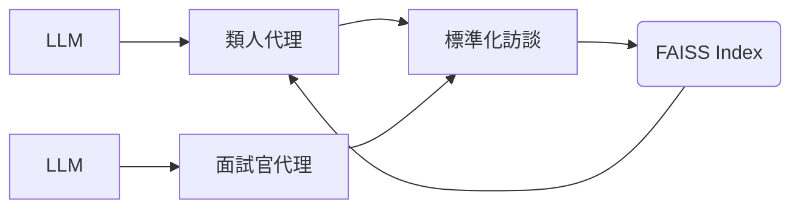

# character-background
Character background settings. Inspired by character.ai
`https://medium.com/@adlerai/character-attributes-on-character-ai-7ddb95c12d1b`
 
人格特質、社交、能力關鍵字按照以下字典隨機產生
[屬性列表在這邊](personality_dic.md)

[AI面試官spec](interviewer_spec.md)
[人格特質在這邊](humanoid_spec.md)

## 參考資料
https://medium.com/@adlerai/character-ai-character-profile-definition-example-template-0a5eaf86ec5b

https://medium.com/@adlerai/character-attributes-on-character-ai-7ddb95c12d1b

https://medium.com/@adlerai/creating-a-character-ai-character-profile-5d50d2007a7f
