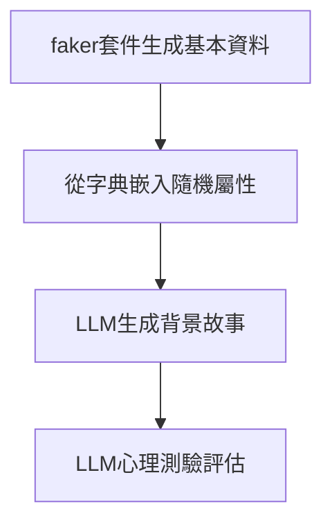

# humanoid agent 類人代理

[回主說明](../README.md)

基於LLM的agent生成模組

## 一、系統流程


## 二、數據結構規範

### 2.1 基礎資訊結構
使用Faker套件產生，[zh-TW 資料有做增強](https://github.com/joke2k/faker/pull/2207)

```json
{
  "基本資料": {
    "姓名": "林曉婷",
    "年紀": 32,
    "性別": "女",
    "生日": "1991-08-22",
    "出生地": "臺北市"
  }
}
```

### 2.2 屬性嵌入結構
人格特質、社交能力、能力屬性有很多類別

```json
{
  "人格特質": ["善於分析", "獨立自主", "風險偏好",...],
  "社交能力": ["衝突調解", "團隊協作",...],
  "能力屬性": ["危機處理", "快速學習",...]
}
```
[完整屬性列表在這邊](personality_dic.md)

### 2.3 完整輸出結構
```json
{
  "基本資料": {
    "姓名": "蔣家宏",
    "年紀": 23,
    "性別": "男",
    "出生地": "斗六"
  },
  "人格屬性": {
    "人格特質": [
      "目標明確"
    ],
    "社交能力": [
      "外向活潑",
      "指導他人",
      "敏感細膩"
    ],
    "能力屬性": [
      "壓力管理"
    ]
  },
  "生平故事": "蔣家宏，現年23歲，出生於雲林縣的斗六市。從小，家宏就展現出一種與生俱來的目標導向特質。他的父母都是當地的教師，家庭環境充滿教育的氛圍，這讓家宏從小便對知識有著強烈的求知慾。家宏是家中的長子，下面還有一個小他五歲的妹妹。他對妹妹總是呵護備至，並在學業上扮演著小老師的角色。\n\n童年時期，家宏常常參加學校的各類競賽，無論是科學展覽或是語文比賽，總能見到他的身影。這些經歷不僅培養了他的競爭意識，也讓他學會在壓力下保持冷靜。家宏的父母時常鼓勵他挑戰自我，這也成為他後來能夠良好管理壓力的一個重要原因。\n\n在高中時期，家宏對心理學產生了濃厚的興趣。他開始閱讀大量相關書籍，並嘗試用其中的知識來幫助身邊的朋友解決問題。他的敏感細膩和外向活潑的性格讓他在社交場合中如魚得水，常常能成為團體中的焦點。這些特質也使他在班上的指導角色中大放異彩，時常被同學推選為班長。\n\n家宏選擇在台北的一所大學攻讀心理學，並專注於壓力管理的研究。這一決定不僅符合他的職業志向，也讓他有機會結識更多志同道合的朋友。他在大學裡積極參加各類社團活動，並在其中扮演著領導和指導的角色。他的社交風格和善於指導他人的能力讓他在團隊中深受歡迎。\n\n畢業後，家宏選擇成為一名職業諮詢師，專門輔導職場人士的壓力管理問題。這份工作讓他能夠把自己所學的知識和人生經歷付諸實踐，幫助更多的人。他的興趣愛好還包括運動和旅行，這不僅讓他保持健康的體魄，也讓他有更多機會接觸不同的文化和人群，進一步拓展自己的視野。\n\n總的來說，蔣家宏是一個充滿活力、目標明確且具有優秀壓力管理能力的年輕人，他的人生故事正如他所處理的每一件事一樣，充滿了挑戰與成就。"
}
```

## 三、技術實現

### 3.1 基礎資料生成
```python
        {
            "姓名": self.fake.name(),
            "年紀": self.fake.random_int(18, 65),
            "性別": self.fake.random_element(["男", "女"]),
            "生日": self.fake.date_of_birth().strftime("%Y-%m-%d"),
            "出生地": self.fake.city()
        }
```

### 3.2 屬性隨機嵌入
```python
        {
            **base_info,
            "人格特質": self._random_select("人格特質", 3),
            "社交能力": self._random_select("社交能力", 2),
            "能力屬性": self._random_select("能力屬性", 2)
        }
    
    def _random_select(self, category, max_items):
        return random.sample(self.attributes[category], k=random.randint(1, max_items))
```

### 3.3 故事生成提示詞

使用prompt engineering做出故事內容

```python
STORY_PROMPT = """
根據以下個人資料與人格特質，生成詳細背景故事：
{基本資料}

人格特點：
- 主要特質：{人格特質}
- 社交風格：{社交能力}
- 特殊能力：{能力屬性}

要求：
1. 包含童年經歷與重大人生事件
2. 說明職業選擇與興趣愛好
3. 字數300-500字
4. 使用臺灣在地化用語
"""
```

### 3.4 心理評估提示詞

(目前沒有計畫做出心理評估)

```python
ASSESSMENT_PROMPT = """
分析以下故事內容，嚴格使用JSON格式回傳：
{故事內容}

評估項目：
1. MBTI類型（含認知功能排序）
2. EPQ三維度分數（0-100）
3. 大五人格分數（0-100）
4. 黑暗三角人格分數（0-100）

輸出要求：
- 分數需符合心理學常模分佈
- 禁用解釋性文字
- 禁用顏文字
"""
```

## 四、品質管控
(略)

## 五、輸出示例

(目前沒有計畫做出心理評估)

```json
{
  "基本資料": {
    "姓名": "陳冠宇",
    "年紀": 28,
    "性別": "男",
    "生日": "1995-11-03",
    "出生地": "高雄市"
  },
  "人格屬性": {
    "人格特質": ["冒險精神", "冷靜沉著"],
    "社交能力": ["幽默風趣", "善於傾聽"],
    "能力屬性": ["危機處理", "快速學習"]
  },
  "生平故事": "陳冠宇成長於高雄旗津漁村...",
  "心理評估": {
    "MBTI": "ISTP",
    "EPQ": {"精神質": 40, "外向性": 60, "神經質": 25},
    "大五人格": {"開放性":80, "盡責性":45, "外向性":65, "宜人性":35, "神經質":20},
    "黑暗三角人格": {"權謀主義":20, "自戀":30, "心理變態":10}
  }
}
```

## 六、輸出分析

隨機生成10組代理提示詞，1組提示詞平均消耗849.8個token
