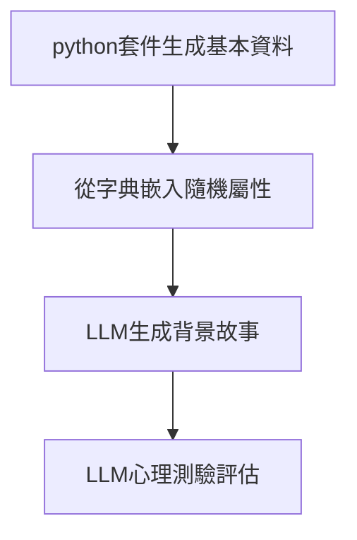

# persona-dough
基於LLM的agent生成模組

## 一、系統流程


## 二、數據結構規範

### 2.1 基礎資訊結構
```json
{
  "基本資料": {
    "姓名": "林曉婷",
    "年紀": 32,
    "性別": "女",
    "生日": "1991-08-22",
    "出生地": "臺北市"
  }
}
```

### 2.2 屬性嵌入結構
人格特質、社交能力、能力屬性有很多類別，這份文件暫時不會顯示

```json
{
  "人格特質": ["善於分析", "獨立自主", "風險偏好",...],
  "社交能力": ["衝突調解", "團隊協作",...],
  "能力屬性": ["危機處理", "快速學習",...]
}
```

### 2.3 完整輸出結構
```json
{
  "基本資料": {...},
  "人格屬性": [...],
  "生平故事": "林曉婷出生於臺北萬華區...", 
  "心理評估": {
    "MBTI": "ISTP",
    "EPQ": {"精神質": 35, "外向性": 65, "神經質": 15},
    "OCEAN大五人格": {"開放性":75, "盡責性":40, "外向性":60, "宜人性":30, "神經質":20},
    "黑暗三角人格": {"權謀主義":15, "自戀":25, "心理變態":5}
  }
}
```

## 三、技術實現

### 3.1 基礎資料生成
```python
from faker import Faker

class BaseInfoGenerator:
    def __init__(self):
        self.fake = Faker('zh_TW')
        
    def generate(self):
        return {
            "姓名": self.fake.name(),
            "年紀": self.fake.random_int(18, 65),
            "性別": self.fake.random_element(["男", "女"]),
            "生日": self.fake.date_of_birth().strftime("%Y-%m-%d"),
            "出生地": self.fake.city()
        }
```

### 3.2 屬性隨機嵌入
```python
class AttributeInjector:
    def __init__(self):
        self.attributes = {
            "人格特質": ["謹慎細心", "冒險精神", "情感豐富", "邏輯至上",...],
            "社交能力": ["領導魅力", "傾聽能力", "幽默風趣",...],
            "能力屬性": ["時間管理", "多工處理", "創意發想",...]
        }
    
    def inject(self, base_info):
        return {
            **base_info,
            "人格特質": self._random_select("人格特質", 3),
            "社交能力": self._random_select("社交能力", 2),
            "能力屬性": self._random_select("能力屬性", 2)
        }
    
    def _random_select(self, category, max_items):
        return random.sample(self.attributes[category], k=random.randint(1, max_items))
```

### 3.3 故事生成提示詞
```python
STORY_PROMPT = """
根據以下個人資料與人格特質，生成詳細背景故事：
{基本資料}

人格特點：
- 主要特質：{人格特質}
- 社交風格：{社交能力}
- 特殊能力：{能力屬性}

要求：
1. 包含童年經歷與重大人生事件
2. 說明職業選擇與興趣愛好
3. 字數300-500字
4. 使用臺灣在地化用語
"""
```

### 3.4 心理評估提示詞
```python
ASSESSMENT_PROMPT = """
分析以下故事內容，嚴格使用JSON格式回傳：
{故事內容}

評估項目：
1. MBTI類型（含認知功能排序）
2. EPQ三維度分數（0-100）
3. 大五人格分數（0-100）
4. 黑暗三角人格分數（0-100）

輸出要求：
- 分數需符合心理學常模分佈
- 禁用解釋性文字
- 禁用顏文字
"""
```

## 四、品質管控
(略)

## 五、輸出示例
```json
{
  "基本資料": {
    "姓名": "陳冠宇",
    "年紀": 28,
    "性別": "男",
    "生日": "1995-11-03",
    "出生地": "高雄市"
  },
  "人格屬性": {
    "人格特質": ["冒險精神", "冷靜沉著"],
    "社交能力": ["幽默風趣", "善於傾聽"],
    "能力屬性": ["危機處理", "快速學習"]
  },
  "生平故事": "陳冠宇成長於高雄旗津漁村...",
  "心理評估": {
    "MBTI": "ISTP",
    "EPQ": {"精神質": 40, "外向性": 60, "神經質": 25},
    "大五人格": {"開放性":80, "盡責性":45, "外向性":65, "宜人性":35, "神經質":20},
    "黑暗三角人格": {"權謀主義":20, "自戀":30, "心理變態":10}
  }
}
```

## 屬性列表
[屬性列表在這邊](personality_dic.md)


