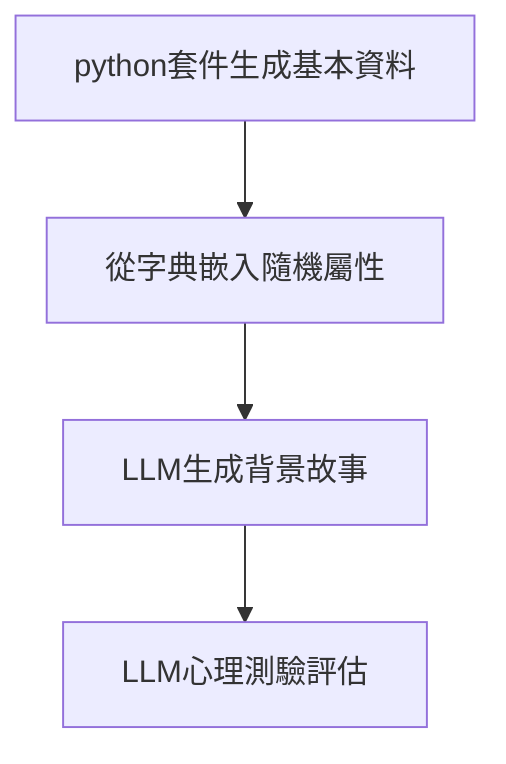

# 人格生成模組技術規格書  

## 一、系統流程


## 二、數據結構規範

### 2.1 基礎資訊結構
```json
{
  "基本資料": {
    "姓名": "林曉婷",
    "年紀": 32,
    "性別": "女",
    "生日": "1991-08-22",
    "出生地": "臺北市"
  }
}
```

### 2.2 屬性嵌入結構
人格特質、社交能力、能力屬性有很多類別，這份文件暫時不會顯示

```json
{
  "人格特質": ["善於分析", "獨立自主", "風險偏好",...],
  "社交能力": ["衝突調解", "團隊協作",...],
  "能力屬性": ["危機處理", "快速學習",...]
}
```

### 2.3 完整輸出結構
```json
{
  "基本資料": {...},
  "人格屬性": [...],
  "生平故事": "林曉婷出生於臺北萬華區...", 
  "心理評估": {
    "MBTI": "ISTP",
    "EPQ": {"精神質": 35, "外向性": 65, "神經質": 15},
    "OCEAN大五人格": {"開放性":75, "盡責性":40, "外向性":60, "宜人性":30, "神經質":20},
    "黑暗三角人格": {"權謀主義":15, "自戀":25, "心理變態":5}
  }
}
```

## 三、技術實現

### 3.1 基礎資料生成
```python
from faker import Faker

class BaseInfoGenerator:
    def __init__(self):
        self.fake = Faker('zh_TW')
        
    def generate(self):
        return {
            "姓名": self.fake.name(),
            "年紀": self.fake.random_int(18, 65),
            "性別": self.fake.random_element(["男", "女"]),
            "生日": self.fake.date_of_birth().strftime("%Y-%m-%d"),
            "出生地": self.fake.city()
        }
```

### 3.2 屬性隨機嵌入
```python
class AttributeInjector:
    def __init__(self):
        self.attributes = {
            "人格特質": ["謹慎細心", "冒險精神", "情感豐富", "邏輯至上",...],
            "社交能力": ["領導魅力", "傾聽能力", "幽默風趣",...],
            "能力屬性": ["時間管理", "多工處理", "創意發想",...]
        }
    
    def inject(self, base_info):
        return {
            **base_info,
            "人格特質": self._random_select("人格特質", 3),
            "社交能力": self._random_select("社交能力", 2),
            "能力屬性": self._random_select("能力屬性", 2)
        }
    
    def _random_select(self, category, max_items):
        return random.sample(self.attributes[category], k=random.randint(1, max_items))
```

### 3.3 故事生成提示詞
```python
STORY_PROMPT = """
根據以下個人資料與人格特質，生成詳細背景故事：
{基本資料}

人格特點：
- 主要特質：{人格特質}
- 社交風格：{社交能力}
- 特殊能力：{能力屬性}

要求：
1. 包含童年經歷與重大人生事件
2. 說明職業選擇與興趣愛好
3. 字數300-500字
4. 使用臺灣在地化用語
"""
```

### 3.4 心理評估提示詞
```python
ASSESSMENT_PROMPT = """
分析以下故事內容，嚴格使用JSON格式回傳：
{故事內容}

評估項目：
1. MBTI類型（含認知功能排序）
2. EPQ三維度分數（0-100）
3. 大五人格分數（0-100）
4. 黑暗三角人格分數（0-100）

輸出要求：
- 分數需符合心理學常模分佈
- 禁用解釋性文字
- 禁用顏文字
"""
```

## 四、品質管控
(略)

## 五、輸出示例
```json
{
  "基本資料": {
    "姓名": "陳冠宇",
    "年紀": 28,
    "性別": "男",
    "生日": "1995-11-03",
    "出生地": "高雄市"
  },
  "人格屬性": {
    "人格特質": ["冒險精神", "冷靜沉著"],
    "社交能力": ["幽默風趣", "善於傾聽"],
    "能力屬性": ["危機處理", "快速學習"]
  },
  "生平故事": "陳冠宇成長於高雄旗津漁村...",
  "心理評估": {
    "MBTI": "ISTP",
    "EPQ": {"精神質": 40, "外向性": 60, "神經質": 25},
    "大五人格": {"開放性":80, "盡責性":45, "外向性":65, "宜人性":35, "神經質":20},
    "黑暗三角人格": {"權謀主義":20, "自戀":30, "心理變態":10}
  }
}
```

## 屬性列表
```python
        # 載入屬性對照表
personality_traits = [
            "情感豐富", "適應力強", "善於調適", "冒險精神", "利他主義", "野心勃勃", "中向人格", "善於分析", "平易近人", "傲慢自大", "口齒伶俐", "藝術氣質", "果斷自信", "真實誠懇", "威嚴穩重", "平衡穩健", "大膽無畏", "勇敢堅毅", "沉著冷靜", "能力出眾", "無憂無慮", "關懷他人", "魅力非凡", "樂善好施", "風度翩翩", "騎士精神", "擅長合作", "全心投入", "善於溝通", "富有同情心", "競爭意識", "性格複雜", "鎮定自若", "充滿自信", "衝突調解", "盡責可靠", "體貼周到", "深思熟慮", "樂於配合", "勇氣可嘉", "彬彬有禮", "創意無限", "好奇心強", "狡詐欺騙", "決斷果敢", "奉獻精神", "謹慎行事", "值得信賴", "意志堅定", "勤奮努力", "外交手腕", "洞察力強", "自律嚴謹", "謹言慎行", "目標明確", "情緒化", "情商高超", "同理心強", "賦能他人", "鼓舞人心", "精力充沛", "進取精神", "熱情洋溢", "道德高尚", "善於表達", "活力四射", "無所畏懼", "靈活變通", "專注力強", "寬宏大量", "坦率直言", "自由奔放", "友善親切", "慷慨大方", "溫柔體貼", "真誠可靠", "善於傾聽", "性情溫和", "親切有禮", "交際廣泛", "心懷感恩", "腳踏實地", "勤勞刻苦", "誠實守信", "謙遜有禮", "幽默風趣", "理想主義", "愚昧無知", "想像力豐富", "公正無私", "獨立自主", "勤奮刻苦", "創新思維", "求知若渴", "見解獨到", "鼓舞人心", "激勵他人", "正直誠信", "聰明睿智", "內向性格", "直覺敏銳", "發明創造", "歡欣喜悅", "公正嚴明", "善良仁慈", "知識淵博", "領導才能", "傾聽者", "邏輯清晰", "忠誠可靠", "慾望強烈", "成熟穩重", "指導他人", "有條不紊", "心思縝密", "謙虛低調", "激勵人心", "負面消極", "談判專家", "培育養育", "客觀公正", "觀察入微", "思想開明", "樂觀向上", "有條有理", "原創精神", "外向活潑", "心直口快", "熱情洋溢", "耐心十足", "洞察敏銳", "堅持不懈", "說服力強", "哲學思考", "玩心十足", "彬彬有禮", "實際務實", "原則性強", "主動積極", "善解難題", "進步思想", "保護慾強", "理性思考", "現實主義", "反思自省", "可靠穩重", "含蓄內斂", "適應力強", "足智多謀", "尊重他人", "敢於冒險", "浪漫情懷", "自信滿滿", "自我認知", "自律嚴格", "自力更生", "無私奉獻", "敏感細膩", "真摯誠懇", "善於交際", "精神抖擻", "隨性而為", "堅定不移", "堅忍克己", "策略思考", "意志堅強", "支持鼓勵", "同情理解", "圓滑得體", "團隊精神", "堅韌不拔", "體貼入微", "寬容大度", "有害人格", "透明公開", "信任他人", "容易信任", "值得信賴", "謙遜質樸", "不循常規", "善解人意", "獨特個性", "不裝腔作勢", "英勇無畏", "多才多藝", "活力充沛", "遠見卓識", "熱心腸", "機智風趣"
        ]
        
social_abilities = [
            "適應力強", "平易近人", "果斷自信", "專注傾聽", "關懷他人", "魅力非凡", "指導能力", "擅長合作", "善於溝通", "富有同情心", "充滿自信", "衝突調解", " 體貼周到", "樂於配合", "彬彬有禮", "創意解難", "值得信賴", "外交手腕", "情緒智商", "同理心強", "鼓舞人心", "善於互動", "熱情洋溢", "靈活變通", "友善親切", "慷慨大方", "善於傾聽", "樂於助人", "誠實守信", "創新思維", "鼓舞人心", "內向性格", "直覺敏銳", "領導才能", "傾聽者", "指導他人", "激勵人心", "談判專家", "培育養育", "觀察入微", "思想開明", "樂觀向上", "外向活潑", "耐心十足", "說服力強", "彬彬有禮", "積極正面", "主動積極", "善解難題", "可靠穩重", "適應力強", "足智多謀", "尊重他人", "自我認知", "敏感細膩", "善於交際", "支持鼓勵", "圓滑得體", "教學能力", "團隊精神", "寬容大度", "透明公開", "值得信賴", "善解人意"
        ]
        
capabilities = [
           "適應能力", "注重細節", "戰鬥技能", "溝通能力", "衝突解決", "創造力", "批判性思維", "決策能力", "外交手腕", "情緒智商", "創業精神", "外語能力", "領導才能", "多工處理", "談判技巧", "組織能力", "解決問題", "抗壓能力", "隨機應變", "自我激勵", "戰略規劃", "戰略思維", "壓力管理", "生存技能", "團隊合作", "專業技能", "時間管理"
        ]
```


